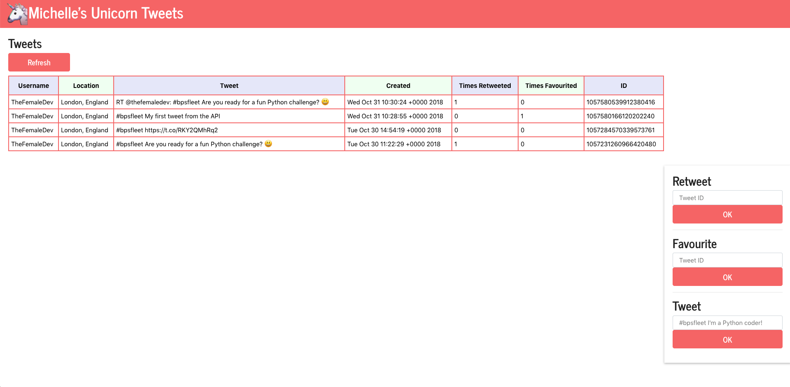

# Unicorn Tweeters Coding Challenge

You have been provided with some working code for the user interface and the inner workings to connect
to the Twitter application program interface (API).

After you have set up your workstation and connected your Raspberry Pi, open a terminal and run the following commands:

Make sure you are in the right directory by running:

```
pwd
```

If you are then it will return with ```/pi/home/Desktop/unicorn-tweeters```

If you are not, then call ```cd Desktop/unicorn-tweeters```

To run the Python script, simply call:

```
python3 run.py
```

The frontend webpage is accessible on http://localhost:5000

## Tasks

#### 1) Show the Tweet ID on the website
* Change ```run.py```
* Change ```view.html```
(Hint:
```"id":1049783444971147271```, files to be changed  and )

#### 2) Show how many times a tweet was retweeted
* Change ```run.py```
* Change ```view.html```
> Hint: ```"retweet_count": 2```

#### 3) Show how many times a tweet was favourited
* Change ```run.py```
* Change ```view.html```
> Hint: ```"favorite_count": 1```

#### 4) Implement the ability to retweet from the website
* (```view.html```)
* (```run.py```)

#### 5) Add new 'Tweet' functionality to the website
* (```view.html```)
* (```run.py```)

#### 6) Customise your website, change it to your favourite colours, change 'Unicorn Tweeters' to your unique team name
#### 7) Draw some other functionality you'd love to see and think about how

## Possible Solution


## URLs of interest

#### Favourite

```
https://api.twitter.com/1.1/favorites/create.json?id={tweet_id}
```
e.g.
```
https://api.twitter.com/1.1/favorites/create.json?id=1050063156230410240
```

#### Retweet

```
https://api.twitter.com/1.1/statuses/retweet/{tweet_id}.json
```
e.g.
```
https://api.twitter.com/1.1/statuses/retweet/1050063156230410240.json
```

#### Post new tweet

```
https://api.twitter.com/1.1/statuses/update.json
```

Body: key ```status```, value {{status}}


### Solution Hints

```
tweets["id"]
```

```
tweets["favorite_count"]
```

```
payload = { 'status' : 'Hi everyone at #bpsfleet' }
requests.post(url="https://api.twitter.com/1.1/statuses/update.json", data=payload, auth=oauth)
```

```
parameters = { "id": tweet_id }
response = requests.post(url="https://api.twitter.com/1.1/favorites/create.json", auth=get_oauth(), params=parameters)
```
