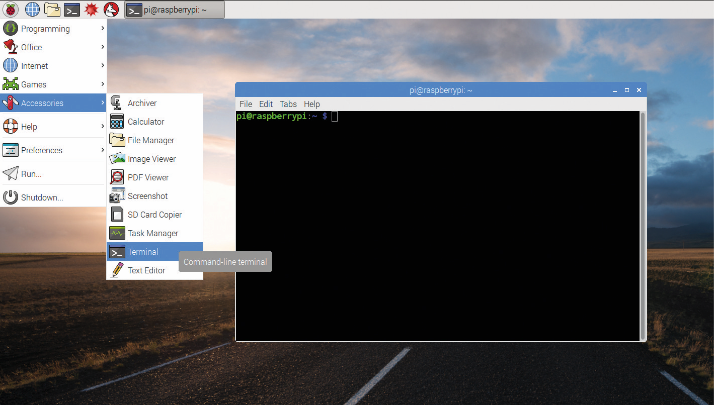
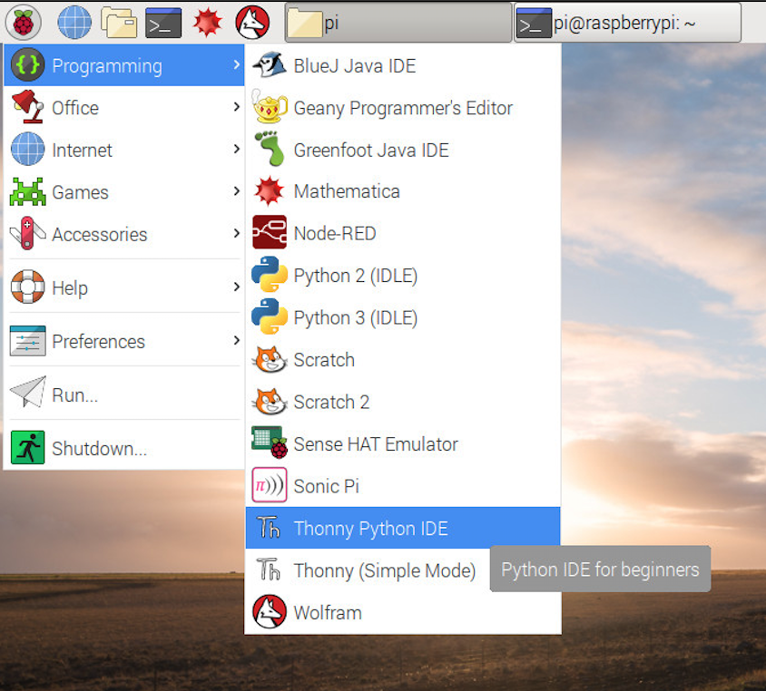
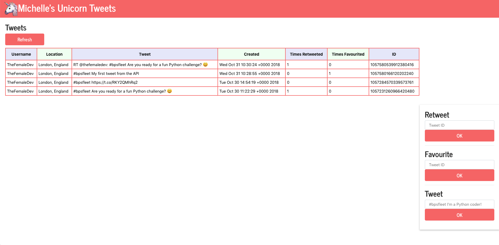

# Unicorn Tweeters Coding Challenge

You have been provided with some working code for the user interface and the inner workings to connect
to the Twitter application program interface (API).

After you have set up your workstation and connected your Raspberry Pi, open a terminal...



Firstly make sure you are in the right directory by running:

```
pwd
```

If you are, then it will return with ```/pi/home/Desktop/unicorn-tweeters```

If you are not, then run ```cd /pi/home/Desktop/unicorn-tweeters```

To run the Python script, simply run:

```
python3 run.py
```

The frontend webpage is then accessible at http://localhost:5000

## Code files

The files you will need to edit are in ```/pi/home/Desktop/unicorn-tweeters```

* ```run.py``` - Main Python executable
* ```templates/view.html``` - HTML template

## How to edit the files
To edit the files, you can use ```Thonny```




## Tasks
### 1) Share your first Tweet!
On the right hand-side, we already have the ability to add new Tweets. Add a new Tweet using #bpsfleet and share your thoughts on today! <br />
Don't forget to click the 'Refresh' button to get your Tweet to appear.

### 2) Show the Tweet ID on the website
The application already supports tweeting but before we can retweet or like a Tweet, we need to know its ID.
In order to do this we need to add a Tweet ID column to the list of Tweets.
> Solution hint:
```
tweets["id"]
```

### 3) Add the ability to like tweets from the website
Now that we know the Tweet IDs, we can allow the website to submit a request to like it.
> Solution hint:
```
parameters = { "id": tweet_id }
response = requests.post(url="https://api.twitter.com/1.1/favorites/create.json", auth=get_oauth(), params=parameters)
```

### 4) Show how many times a Tweet was liked
How many likes has the Tweet had? Why don't we add it and see?
> Solution hint:
```
tweets["favorite_count"]
```

### 5) Implement the ability to retweet from the website
Using the Tweet ID, let's add the ability to retweet.
> Solution hint:
```
https://api.twitter.com/1.1/statuses/retweet/{tweet_id}.json
```

### 6) Show how many times a Tweet has been retweeted
We now want to be able to see how many times all the tweets have been retweeted.
> Solution hint:
```
"retweet_count": 2
```

### 7) Customise your website, change it to your favourite colours, change 'Unicorn Tweeters' to your unique team name
### 8) Draw some other functionality you'd love to see and think about how

## Possible Solution

